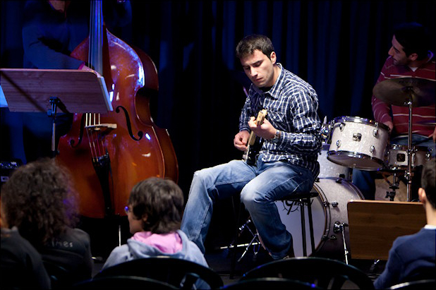

## My path on music

Long before engineering, I developed a passion for music, beginning classical guitar lessons at the age of 10 under the guidance of Rui Cardoso and Eduardo Carvalho in my village. Much later, I started studying jazz at the professional school Jazz Ao Norte in Sandro Norton’s guitar class and Nuno Campos’s harmony and improvisation class. Later, I studied improvisation with António Pedro Neves and Pedro Barreiros, played in jazz combos and small ensembles at Escola de Jazz do Porto, Valentim de Carvalho, and Jahas. I continuded my never ending study journey with private lessons with Carlos Mendes, which were particularly influential in my learning journey.

Throughout my improvisation studies, I had the opportunity to attend masterclasses and workshops with Romain Pilon, Jakob Bro, Guillermo Klein, Perico Sambeat, Jason Palmer, and Chico Pinheiro. In 2013, I participated in the Begues Jazz Camp in Barcelona with Michael Kanan, Charles Davis, Putter Smith, Jimmy Wormworth, and Jorge Rossy as Camp masters. 

Playing live
--

*Jazz ao Norte, 2010*

